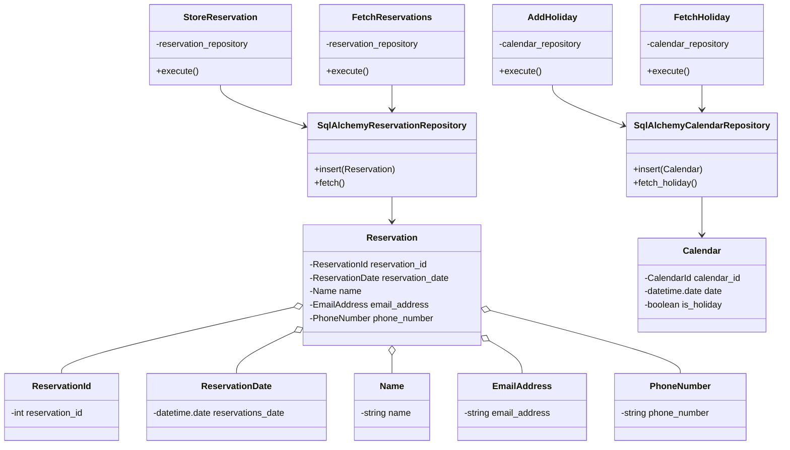

```mermaid
classDiagram
    StoreReservation --> SqlAlchemyReservationRepository
    class StoreReservation{
      -reservation_repository
      +execute()
    }

    FetchReservations --> SqlAlchemyReservationRepository
    class FetchReservations {
      -reservation_repository
      +execute()
    }

    SqlAlchemyReservationRepository --> Reservation
    class SqlAlchemyReservationRepository{
      +insert(Reservation)
      +fetch()
    }

    Reservation o-- ReservationId
    Reservation o-- ReservationDate
    Reservation o-- Name
    Reservation o-- EmailAddress
    Reservation o-- PhoneNumber
    class Reservation{
      -ReservationId reservation_id
      -ReservationDate reservation_date
      -Name name
      -EmailAddress email_address
      -PhoneNumber phone_number
    }
    class ReservationId{
      -int reservation_id
    }
    class ReservationDate{
      -datetime.date reservations_date
    }
    class Name{
      -string name
    }
    class EmailAddress{
      -string email_address
    }
    class PhoneNumber{
      -string phone_number
    }

    AddHoliday --> SqlAlchemyCalendarRepository
    class AddHoliday{
      -calendar_repository
      +execute()
    }

    FetchHoliday --> SqlAlchemyCalendarRepository
    class FetchHoliday{
      -calendar_repository
      +execute()
    }

    SqlAlchemyCalendarRepository --> Calendar
    class SqlAlchemyCalendarRepository{
      +insert(Calendar)
      +fetch_holiday()
    }
    class Calendar{
      -CalendarId calendar_id
      -datetime.date date
      -boolean is_holiday
    }
```