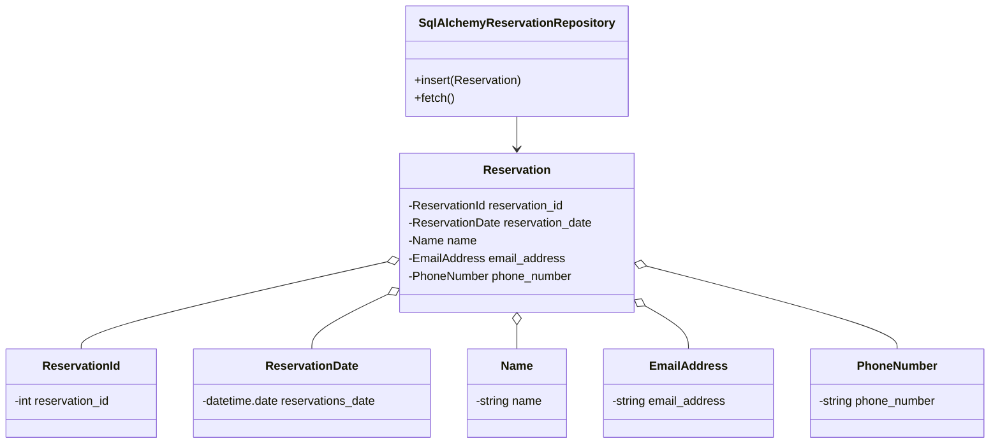

```mermaid
classDiagram
    SqlAlchemyReservationRepository --> Reservation
    class SqlAlchemyReservationRepository{
      +insert(Reservation)
      +fetch()
    }

    Reservation o-- ReservationId
    Reservation o-- ReservationDate
    Reservation o-- Name
    Reservation o-- EmailAddress
    Reservation o-- PhoneNumber
    class Reservation{
      -ReservationId reservation_id
      -ReservationDate reservation_date
      -Name name
      -EmailAddress email_address
      -PhoneNumber phone_number
    }
    class ReservationId{
      -int reservation_id
    }
    class ReservationDate{
      -datetime.date reservations_date
    }
    class Name{
      -string name
    }
    class EmailAddress{
      -string email_address
    }
    class PhoneNumber{
      -string phone_number
    }
```