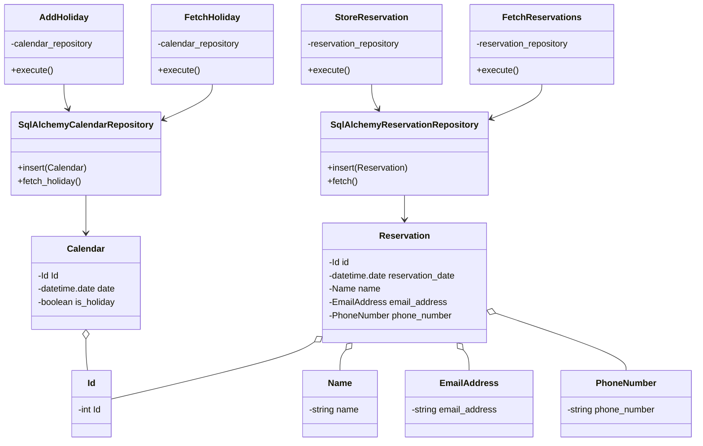

```mermaid
classDiagram
  StoreReservation --> SqlAlchemyReservationRepository
  class StoreReservation{
    -reservation_repository
    +execute()
  }

  FetchReservations --> SqlAlchemyReservationRepository
  class FetchReservations {
    -reservation_repository
    +execute()
  }

  SqlAlchemyReservationRepository --> Reservation
  class SqlAlchemyReservationRepository{
    +insert(Reservation)
    +fetch()
  }

  Reservation o-- Id
  Reservation o-- Name
  Reservation o-- EmailAddress
  Reservation o-- PhoneNumber
  class Reservation{
    -Id id
    -datetime.date reservation_date
    -Name name
    -EmailAddress email_address
    -PhoneNumber phone_number
  }
  class Name{
    -string name
  }
  class EmailAddress{
    -string email_address
  }
  class PhoneNumber{
    -string phone_number
  }

  AddHoliday --> SqlAlchemyCalendarRepository
  class AddHoliday{
    -calendar_repository
    +execute()
  }

  FetchHoliday --> SqlAlchemyCalendarRepository
  class FetchHoliday{
    -calendar_repository
    +execute()
  }

  SqlAlchemyCalendarRepository --> Calendar
  class SqlAlchemyCalendarRepository{
    +insert(Calendar)
    +fetch_holiday()
  }

  Calendar o-- Id
  class Calendar{
    -Id Id
    -datetime.date date
    -boolean is_holiday
  }
  class Id{
    -int Id
  }
```
